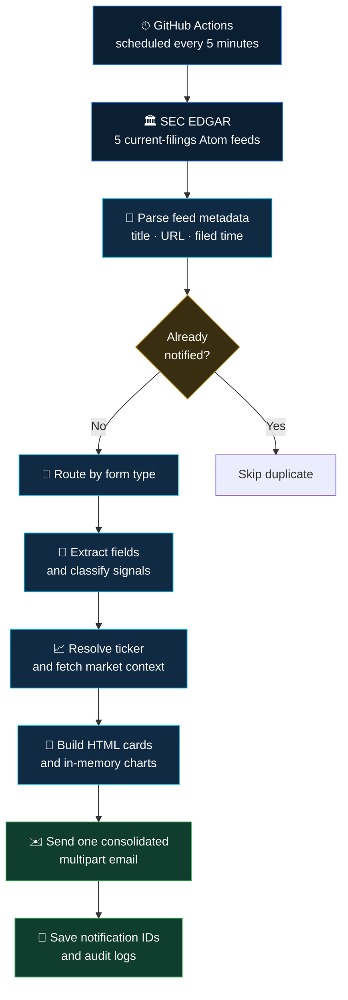

*Real photography by [Daniel Brzdęk on Unsplash](https://unsplash.com/photos/financial-stock-market-data-displayed-on-a-screen-EuIqk6LpUU0).*

# SEC News Scraper

### Regulatory filings in. Decision-ready intelligence out.

An automated Python pipeline that monitors live SEC EDGAR feeds, understands five high-signal filing types, enriches them with market data, and delivers polished email briefings — with no dashboard to babysit.

[](https://github.com/TanishC4444/SECnewsScraper/actions/workflows/sec_monitor.yml)


[Purpose](#purpose) · [Pipeline](#the-pipeline) · [Filing intelligence](#filing-intelligence) · [Quick start](#quick-start) · [Engineering](#engineering-deep-dive) · [Roadmap](#high-value-next-steps)

---

## The project, at a glance

|              |                                                                                                                               |
| ------------ | ----------------------------------------------------------------------------------------------------------------------------- |
| **Problem**  | Critical filings are public, but turning raw regulatory documents into timely, readable context is repetitive and fragmented. |
| **Solution** | A scheduled ingestion → classification → enrichment → visualization → notification pipeline.                                  |
| **Coverage** | `8-K` · `Form 144` · `S-1MEF` · `EFFECT` · `SD`                                                                               |
| **Output**   | One consolidated HTML email with filing signals, market context, charts, and direct SEC source links.                         |
| **Runtime**  | Python 3.10 on GitHub Actions, scheduled every five minutes and available on demand.                                          |
| **State**    | CIK/accession-based deduplication persisted through repository log files.                                                     |

> **Note:** This project produces deterministic research heuristics — not financial advice. Every briefing links back to the original SEC filing for verification.

## Purpose

This is a **personal quantitative-finance and automation learning project** — a way to get hands-on with real-world data engineering (parsing government filings), financial computation (Decimal-precision ownership math), and systems integration (SEC EDGAR, Yahoo Finance, Gmail SMTP, GitHub Actions) all in one build. It wasn't commissioned or built for a client; it exists to explore what a genuinely useful, zero-infrastructure regulatory alert system looks like when built from scratch.

## Why it stands out

- **Runs on $0 of infrastructure.** No server, no database, no hosting bill — GitHub Actions' free scheduled runner is the entire "backend," and Git-committed log files are the entire "database."
- **Explainable, not a black box.** Every signal (like `VERY BEARISH` for a bankruptcy 8-K) traces back to an explicit, inspectable rule — not a model making an opaque call.
- **Form-aware, not one-size-fits-all.** Five very different SEC filing types each get their own extraction logic, instead of treating every filing as generic text.
- **Financially precise where it matters.** Ownership-impact math uses Python's `Decimal` type rather than floating point, avoiding the rounding errors that plague naive percentage calculations.

## The pipeline

The operational path is intentionally linear: retrieve, reject duplicates, understand the filing, add market context, then notify.



**In plain terms:** every five minutes, a robot wakes up, checks five different SEC filing feeds, and asks "have I already told someone about this filing?" If yes, it moves on. If no, it figures out what kind of filing it is (a bankruptcy notice? an insider stock sale?), pulls in the stock's recent price history to add context, builds a nice-looking chart and HTML email, sends it, and finally writes down that it already handled this filing so it never gets emailed twice.

### What one automation run actually does

```
01  Load notified_log.txt into memory
02  Request the newest filing for each configured form
03  Derive <form>-<CIK>-<accession> identity keys
04  Skip keys that have already been delivered
05  Run the matching form-specific parser and eligibility rules
06  Resolve a probable ticker and request Yahoo Finance data
07  Generate a 30-day price / volume chart in memory
08  Compile every new filing into one HTML briefing
09  Send through Gmail SMTP with STARTTLS
10  Persist IDs and form-specific logs after successful delivery
```

## Filing intelligence

| Filing     | What the code reads                                                           | Signal logic and filtering                                                                                                                  |
| ---------- | ------------------------------------------------------------------------------ | ---------------------------------------------------------------------------------------------------------------------------------------------- |
| **8-K**    | Recognized Item sections and filing text                                      | Maps 20 Item codes to `NEUTRAL`, `WATCH`, `MAJOR WATCH`, `BEARISH`, or `VERY BEARISH`. Unrecognized or empty sections are skipped.          |
| **144**    | Issuer, seller, relationship, shares, market value, and shares outstanding    | Processes proposed sales above **5,000 shares**; calculates ownership impact and separates officer/director sales from other relationships. |
| **S-1MEF** | Company and filing metadata                                                   | Presents the filing as an IPO registration amendment with timing context and original filing links.                                         |
| **EFFECT** | Underlying registration form and effective date                               | Reads the filing's primary XML, explains recognized form types, and filters out `N-2` registrations.                                        |
| **SD**     | Mineral terms, DRC phrases, supplier references, and smelter/refiner mentions | Produces rule-based ESG/compliance labels for tin, tantalum, tungsten, gold, and sourcing status.                                            |

### 8-K severity model

```
VERY BEARISH  >  BEARISH  >  WATCH / MAJOR WATCH  >  NEUTRAL
```

Examples grounded in the lookup table include bankruptcy (`1.03`) and financial restatement (`4.02`) as `VERY BEARISH`, new debt (`2.03`) as `BEARISH`, leadership change (`5.02`) as `WATCH`, and financial statements (`9.01`) as `NEUTRAL`.

### Form 144 ownership impact

```
proposed shares sold
──────────────────── × 100 = percentage of shares outstanding
 shares outstanding
```

Officer/director sales cross signal tiers at `0.1%` and `1.0%`. Other relationships receive a separate institutional-sale classification.

## Market-data enrichment

| Category           | Data used in the briefing                                                                        |
| ------------------- | --------------------------------------------------------------------------------------------------- |
| **Price history**  | 5-day, 1-month, 3-month, and 1-year windows                                                        |
| **Performance**    | Latest move plus 3-month and 1-year-window changes                                                 |
| **Fundamentals**   | Market cap, volume, trailing P/E, price-to-book, dividend yield, and beta                          |
| **Trading ranges** | Daily and 52-week high / low values                                                                |
| **Financials**     | Up to four recent quarterly columns for revenue, net income, gross profit, and operating income   |
| **Visualization**  | A dark two-panel 30-day closing-price and volume chart                                             |

## Quick start

### Requirements

- Python **3.10**
- Gmail with an app password
- Network access to SEC EDGAR and Yahoo Finance

### Install

```bash
git clone https://github.com/TanishC4444/SECnewsScraper.git
cd SECnewsScraper

python -m venv .venv
source .venv/bin/activate

python -m pip install --upgrade pip
python -m pip install requests beautifulsoup4 yfinance matplotlib pandas pytz
```

### Configure

```bash
export EMAIL_PASSWORD="your-gmail-app-password"
```

Then update `EMAIL_ADDRESS`, `RECIPIENT_EMAIL`, and `headers["User-Agent"]` near the top of `main.py`.

> **Caution:** The current source contains a fallback value when `EMAIL_PASSWORD` is absent. Remove that fallback and rotate any exposed credential before deploying or sharing a fork.

### Run

```bash
python main.py
```

**How to use it, step by step:**
1. Clone the repo and install dependencies.
2. Set your Gmail app password as an environment variable (never hardcode it).
3. Update the config values in `main.py` (your email, recipient, and User-Agent).
4. Run `python main.py` once locally to confirm it works.
5. Fork it to enable the scheduled GitHub Action (see below) so it runs every five minutes without you touching it again.

## Enable it in a fork

1. Open **Settings → Secrets and variables → Actions**.
2. Add a repository secret named `EMAIL_PASSWORD`.
3. In **Settings → Actions → General**, allow the workflow to write repository contents so it can persist changed logs.
4. Open **Actions → SEC Filing Monitor → Run workflow**.
5. Review the first run and received email before relying on the schedule.

## Engineering deep dive

**Identity, deduplication, and delivery semantics** — `notified_log.txt` is loaded into a set, giving constant-time membership checks. IDs are written only after the consolidated SMTP send returns successfully, favoring a retry over silently losing an alert after a failed delivery. This is an at-least-once design, not a transaction: simultaneous workflow runs could still race before either one persists its ID.

**Parsing strategy** — SEC feeds use `xml.etree.ElementTree`; 8-K documents are split into Item sections with boundary-aware regex; Form 144 validates numeric XML-like tags; EFFECT tries strict XML then falls back to HTML/text; SD uses normalized text and phrase/synonym matching. Deployment-light and explainable, at the cost of being sensitive to document-layout changes and nuanced prose.

## Decisions and tradeoffs

| Design choice                    | What it buys                                   | What it costs                                                     |
| ---------------------------------- | ------------------------------------------------- | --------------------------------------------------------------------- |
| Latest filing only (`count=1`)   | Small, predictable work per scheduled run        | A burst between runs can be missed                                    |
| Flat-file state committed to Git | No database or hosted state service              | Repository growth, concurrency risk, limited querying                 |
| Synchronous requests             | Straightforward control flow and debugging       | SEC and market calls are serialized                                   |
| Deterministic heuristics         | Fast, explainable classifications                | Narrative nuance and negation may be missed                           |
| Company-name ticker search       | Market context without a maintained symbol map   | The top result can be absent or incorrect                             |
| One Python module                | Extremely simple deployment                      | Tight coupling between parsing, UI, transport, and orchestration      |
| Inline MIME charts               | Rich, self-contained email reports               | Larger messages and uneven email-client CSS support                   |

## Current boundaries

- Feed retrieval and final SMTP failures can fail the whole run; form-level 8-K, 144, and SD errors are isolated more locally.
- Requests are not consistently protected by timeouts, retries, exponential backoff, or explicit rate control.
- The system monitors the newest filing globally for each form, not a custom company watchlist.
- There is no automated test suite, pinned dependency manifest, CLI, database, historical backfill, or concurrency lock.
- Yahoo Finance is optional enrichment — not the source of record.
- All signal labels should be verified against the linked filing before use.

## Impact

This is a personal build used to explore ideas in automation and quant-adjacent engineering, not a production financial service — it produces research heuristics for personal learning, and every claim it makes traces back to a linked source filing for independent verification.

## Engineering skills demonstrated

| Discipline              | Concrete evidence                                                                                        |
| ------------------------ | ----------------------------------------------------------------------------------------------------------- |
| **Data engineering**    | Multi-source ingestion, normalization, routing, enrichment, batching, and persistent processing state     |
| **Document parsing**    | Atom/XML traversal, HTML fallback parsing, regex extraction, entity decoding, and form-specific schemas   |
| **Financial computing** | `Decimal` percentage arithmetic, price windows, fundamentals, and quarterly statement metrics             |
| **Visualization**       | Programmatic price/volume charts, annotations, dark-theme styling, and in-memory image handling           |
| **Systems integration** | SEC EDGAR, Yahoo search, `yfinance`, Gmail SMTP, TLS, MIME, and embedded assets                           |
| **Automation / DevOps** | Cron scheduling, secrets injection, ephemeral-runner setup, and persisted state commits                   |
| **Reliability design**  | Stable identity keys, post-send state writes, error isolation, and enrichment fallback paths              |
| **Information design**  | Filing explanations, severity hierarchy, source links, timestamps, and a consolidated briefing experience |

## Resume-ready impact

> **SEC News Scraper — Python, SEC EDGAR, Yahoo Finance, Matplotlib, GitHub Actions**
> - Engineered an automated regulatory-intelligence pipeline that converts live SEC Atom feeds and raw filing documents into consolidated, form-aware email briefings.
> - Implemented dedicated extraction and explainable classification logic for 8-K, Form 144, S-1MEF, EFFECT, and SD filings.
> - Integrated market fundamentals and historical pricing, generating in-memory Matplotlib charts embedded directly in multipart MIME email.
> - Designed CIK/accession-based deduplication and Git-backed persistence for recurring runs on stateless GitHub Actions infrastructure.

## High-value next steps

```
Security      Remove credential fallbacks and centralize configuration
Quality       Add pinned dependencies and fixture-driven parser tests
Reliability   Add timeouts, retries, backoff, rate control, and concurrency protection
Coverage      Process feed windows safely instead of only count=1
Architecture  Separate clients, parsers, enrichment, templates, and transport
State         Move notification history to a transactional store
Watchlists    Add company-specific watchlists instead of global newest-filing-only monitoring
```

## Responsible use

- Identify automated clients accurately and follow the SEC's [developer and fair-access guidance](https://www.sec.gov/about/developer-resources).
- Treat Yahoo Finance as contextual enrichment and the SEC filing as the authoritative source.
- Keep SMTP credentials in environment variables or GitHub Actions secrets.
- Do not interpret heuristic labels as investment advice or automated trading instructions.

## License

MIT — see [LICENSE](LICENSE).

---

### Built to turn regulatory noise into a readable signal.

**Python · SEC EDGAR · Yahoo Finance · Matplotlib · GitHub Actions · SMTP**
