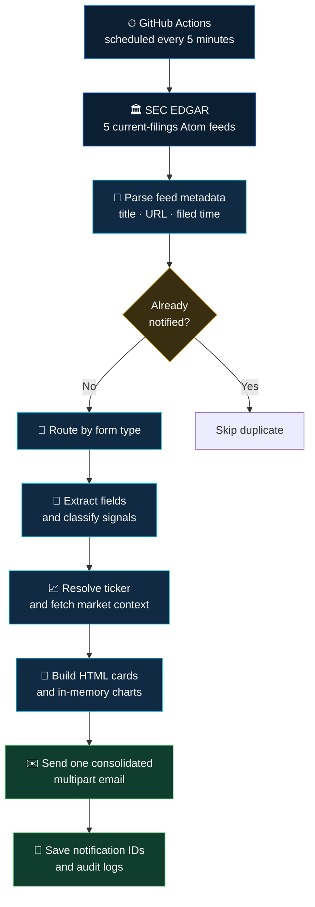
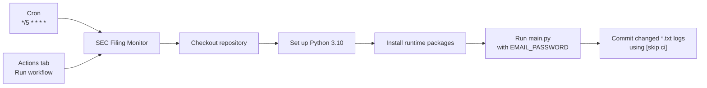

<div align="center">


# SEC News Scraper

### Regulatory filings in. Decision-ready intelligence out.

An automated Python pipeline that monitors live SEC EDGAR feeds, understands five high-signal filing types, enriches them with market data, and delivers polished email briefings—with no dashboard to babysit.

[](https://github.com/TanishC4444/SECnewsScraper/actions/workflows/sec_monitor.yml)
[](https://www.python.org/)


[Explore the pipeline](#-the-pipeline) · [See the filing intelligence](#-filing-intelligence) · [Run it locally](#-quick-start) · [Review the engineering](#-engineering-deep-dive)

</div>

---

## The project, at a glance

| | |
|---|---|
| **Problem** | Critical filings are public, but turning raw regulatory documents into timely, readable context is repetitive and fragmented. |
| **Solution** | A scheduled ingestion → classification → enrichment → visualization → notification pipeline. |
| **Coverage** | `8-K` · `Form 144` · `S-1MEF` · `EFFECT` · `SD` |
| **Output** | One consolidated HTML email with filing signals, market context, charts, and direct SEC source links. |
| **Runtime** | Python 3.10 on GitHub Actions, scheduled every five minutes and available on demand. |
| **State** | CIK/accession-based deduplication persisted through repository log files. |

> [!NOTE]
> This project produces deterministic research heuristics—not financial advice. Every briefing links back to the original SEC filing for verification.

## Why it stands out

<table>
<tr>
<td width="50%" valign="top">

### Form-aware intelligence

Each filing type follows its own extraction and classification path. The system does more than announce that a filing exists—it surfaces the fields and events that make that form useful.

</td>
<td width="50%" valign="top">

### Explainable signals

8-K Item codes, insider-sale thresholds, EFFECT metadata, and conflict-mineral phrases map to explicit rules. The logic is inspectable, fast, and deterministic.

</td>
</tr>
<tr>
<td width="50%" valign="top">

### Market context built in

Company names are resolved to probable tickers, then enriched with price history, fundamentals, quarterly income data, and a generated price/volume chart when data is available.

</td>
<td width="50%" valign="top">

### Stateful serverless automation

Scheduled GitHub Actions runs preserve notification state by committing updated logs, allowing a stateless runner to remember what has already been delivered.

</td>
</tr>
</table>

## The pipeline

The operational path is intentionally linear: retrieve, reject duplicates, understand the filing, add market context, then notify.



### What one automation run actually does

```text
01  Load notified_log.txt into memory
02  Request the newest filing for each configured form
03  Derive <form>-<CIK>-<accession> identity keys
04  Skip keys that have already been delivered
05  Run the matching form-specific parser and eligibility rules
06  Resolve a probable ticker and request Yahoo Finance data
07  Generate a 30-day price / volume chart in memory
08  Compile every new filing into one HTML briefing
09  Send through Gmail SMTP with STARTTLS
10  Persist IDs and form-specific logs after successful delivery
```

## Filing intelligence

| Filing | What the code reads | Signal logic and filtering |
|:---:|---|---|
| **8-K** | Recognized Item sections and filing text | Maps 20 Item codes to `NEUTRAL`, `WATCH`, `MAJOR WATCH`, `BEARISH`, or `VERY BEARISH`. Unrecognized or empty sections are skipped. |
| **144** | Issuer, seller, relationship, shares, market value, and shares outstanding | Processes proposed sales above **5,000 shares**; calculates ownership impact and separates officer/director sales from other relationships. |
| **S-1MEF** | Company and filing metadata | Presents the filing as an IPO registration amendment with timing context and original filing links. |
| **EFFECT** | Underlying registration form and effective date | Reads the filing's primary XML, explains recognized form types, and filters out `N-2` registrations. |
| **SD** | Mineral terms, DRC phrases, supplier references, and smelter/refiner mentions | Produces rule-based ESG/compliance labels for tin, tantalum, tungsten, gold, and sourcing status. |

### 8-K severity model

The system uses the strongest recognized event in the filing as its overall signal:

```text
VERY BEARISH  >  BEARISH  >  WATCH / MAJOR WATCH  >  NEUTRAL
```

Examples grounded in the lookup table include bankruptcy (`1.03`) and financial restatement (`4.02`) as `VERY BEARISH`, new debt (`2.03`) as `BEARISH`, leadership change (`5.02`) as `WATCH`, and financial statements (`9.01`) as `NEUTRAL`.

### Form 144 ownership impact

The parser uses `Decimal` arithmetic rather than binary floating point for the core percentage calculation:

```text
proposed shares sold
──────────────────── × 100 = percentage of shares outstanding
 shares outstanding
```

Officer/director sales cross signal tiers at `0.1%` and `1.0%`. Other relationships receive a separate institutional-sale classification.

### EFFECT and SD interpretation

- **EFFECT:** derives the CIK and accession from the SEC URL, reads `primary_doc.xml`, and extracts the underlying registration form plus effective date. Beautiful Soup and regex provide a fallback when strict XML parsing fails.
- **SD:** normalizes filing text and looks for mineral synonyms, DRC-status language, supplier frequency, and smelter/refiner references. The output is useful for triage, but remains sensitive to phrasing and negation.

## Market-data enrichment

Once a company is resolved to a probable ticker, the pipeline requests:

| Category | Data used in the briefing |
|---|---|
| **Price history** | 5-day, 1-month, 3-month, and 1-year windows |
| **Performance** | Latest move plus 3-month and 1-year-window changes |
| **Fundamentals** | Market cap, volume, trailing P/E, price-to-book, dividend yield, and beta |
| **Trading ranges** | Daily and 52-week high / low values |
| **Financials** | Up to four recent quarterly columns for revenue, net income, gross profit, and operating income |
| **Visualization** | A dark two-panel 30-day closing-price and volume chart |

The generated PNG stays in memory: Matplotlib writes to `BytesIO`, the image is Base64-encoded, and the mailer attaches it with a unique MIME Content-ID. If ticker resolution or market data fails, filing delivery can continue without the chart.

## Email delivery design

Every parser produces the same compact record contract:

```python
{
    "form_type": "8-K",
    "company": "Example Corp",
    "html_content": "<div>...</div>",
    "entry_id": "8-k-<CIK>-<accession>"
}
```

That common shape decouples the batch composer from form-specific parsing. The final message uses:

- `multipart/related` for the HTML briefing and inline chart assets;
- `multipart/alternative` for plain-text and HTML bodies;
- per-chart Content-IDs to prevent attachment collisions;
- Gmail SMTP with STARTTLS for transport;
- a subject line summarizing filing counts by type.

## Quick start

### Requirements

- Python **3.10**
- Gmail with an app password
- Network access to SEC EDGAR and Yahoo Finance

### Install

```bash
git clone https://github.com/TanishC4444/SECnewsScraper.git
cd SECnewsScraper

python -m venv .venv
source .venv/bin/activate

python -m pip install --upgrade pip
python -m pip install requests beautifulsoup4 yfinance matplotlib pandas pytz
```

<details>
<summary><strong>Windows PowerShell equivalent</strong></summary>

```powershell
python -m venv .venv
.venv\Scripts\Activate.ps1
python -m pip install --upgrade pip
python -m pip install requests beautifulsoup4 yfinance matplotlib pandas pytz
```

</details>

> [!NOTE]
> The repository does not currently include a dependency manifest. The packages above mirror the checked-in GitHub Actions workflow.

### Configure

Set the Gmail app password in your environment:

```bash
export EMAIL_PASSWORD="your-gmail-app-password"
```

Then update these values near the top of `main.py`:

| Setting | Purpose |
|---|---|
| `EMAIL_ADDRESS` | Gmail account used to authenticate and send |
| `RECIPIENT_EMAIL` | Destination for the compiled briefing |
| `headers["User-Agent"]` | Descriptive SEC client identity with your contact information |

> [!CAUTION]
> The current source contains a fallback value when `EMAIL_PASSWORD` is absent. Remove that fallback and rotate any exposed credential before deploying or sharing a fork. Store the replacement only in an environment variable or repository secret.

### Run

```bash
python main.py
```

When eligible unseen filings exist, the script sends one batch email and updates local logs. Otherwise, it exits with `No new filings found.`

## Automation, without the guesswork

The repository's workflow has two entry points:



The cron expression requests a run every five minutes, every day, in UTC. GitHub may delay scheduled executions, and the Python code does not restrict runs to stock-market hours.

### Enable it in a fork

1. Open **Settings → Secrets and variables → Actions**.
2. Add a repository secret named `EMAIL_PASSWORD`.
3. In **Settings → Actions → General**, allow the workflow to write repository contents so it can persist changed logs.
4. Open **Actions → SEC Filing Monitor → Run workflow**.
5. Review the first run and received email before relying on the schedule.

The final commit step stages only `*.txt`, writes `Update SEC logs [skip ci]` when state changed, and pushes it back to the active branch.

## Repository map

```text
SECnewsScraper/
├── .github/workflows/
│   └── sec_monitor.yml       scheduled + manual automation
├── assets/
│   └── sec-intelligence-hero.jpg
├── main.py                   complete ingestion-to-email pipeline
├── notified_log.txt          cross-run deduplication state
├── eightk_log.txt            processed 8-K history
├── form144_log.txt           processed Form 144 history
├── s1mef_log.txt             S-1MEF notification history
├── sd_log.txt                processed SD history
├── effect_filings_log.txt    reserved / legacy EFFECT log
├── EIGHTK_LOG_FILE           legacy 8-K artifact
└── README.md
```

## Engineering deep dive

<details open>
<summary><strong>Identity, deduplication, and delivery semantics</strong></summary>

`notified_log.txt` is loaded into a set, giving constant-time membership checks. A filing is normally identified by form type, CIK, and accession number. IDs are written only after the consolidated SMTP send returns successfully, favoring a retry over silently losing an alert after a failed delivery.

This is an at-least-once design, not a transaction: simultaneous workflow runs could still race before either one persists its ID.

</details>

<details>
<summary><strong>Parsing strategy</strong></summary>

- SEC current-filings feeds use `xml.etree.ElementTree`.
- 8-K documents are cleaned and split into Item sections with a boundary-aware regex.
- Form 144 reads XML-like tags and validates the numeric fields needed for its ratio.
- EFFECT attempts strict XML first, then HTML/text fallback parsing.
- SD uses normalized text and transparent phrase/synonym matching.

The approach is deployment-light and explainable. Its tradeoff is that document-layout changes and nuanced prose can outgrow regex and lexical rules.

</details>

<details>
<summary><strong>Why the application is currently one module</strong></summary>

A single `main.py` minimizes deployment ceremony: the workflow installs packages and runs one file. As the project grows, SEC clients, form parsers, market enrichment, templates, SMTP transport, configuration, and orchestration are clear module boundaries that would improve isolated testing and reuse.

</details>

## Decisions and tradeoffs

| Design choice | What it buys | What it costs |
|---|---|---|
| Latest filing only (`count=1`) | Small, predictable work per scheduled run | A burst between runs can be missed |
| Flat-file state committed to Git | No database or hosted state service | Repository growth, concurrency risk, limited querying |
| Synchronous requests | Straightforward control flow and debugging | SEC and market calls are serialized |
| Deterministic heuristics | Fast, explainable classifications | Narrative nuance and negation may be missed |
| Company-name ticker search | Market context without a maintained symbol map | The top result can be absent or incorrect |
| One Python module | Extremely simple deployment | Tight coupling between parsing, UI, transport, and orchestration |
| Inline MIME charts | Rich, self-contained email reports | Larger messages and uneven email-client CSS support |

## Current boundaries

- Feed retrieval and final SMTP failures can fail the whole run; form-level 8-K, 144, and SD errors are isolated more locally.
- Requests are not consistently protected by timeouts, retries, exponential backoff, or explicit rate control.
- The system monitors the newest filing globally for each form, not a custom company watchlist.
- There is no automated test suite, pinned dependency manifest, CLI, database, historical backfill, or concurrency lock.
- Yahoo Finance is optional enrichment—not the source of record.
- All signal labels should be verified against the linked filing before use.

## Engineering skills demonstrated

| Discipline | Concrete evidence |
|---|---|
| **Data engineering** | Multi-source ingestion, normalization, routing, enrichment, batching, and persistent processing state |
| **Document parsing** | Atom/XML traversal, HTML fallback parsing, regex extraction, entity decoding, and form-specific schemas |
| **Financial computing** | `Decimal` percentage arithmetic, price windows, fundamentals, and quarterly statement metrics |
| **Visualization** | Programmatic price/volume charts, annotations, dark-theme styling, and in-memory image handling |
| **Systems integration** | SEC EDGAR, Yahoo search, `yfinance`, Gmail SMTP, TLS, MIME, and embedded assets |
| **Automation / DevOps** | Cron scheduling, secrets injection, ephemeral-runner setup, and persisted state commits |
| **Reliability design** | Stable identity keys, post-send state writes, error isolation, and enrichment fallback paths |
| **Information design** | Filing explanations, severity hierarchy, source links, timestamps, and a consolidated briefing experience |

## Resume-ready impact

> **SEC News Scraper — Python, SEC EDGAR, Yahoo Finance, Matplotlib, GitHub Actions**
>
> - Engineered an automated regulatory-intelligence pipeline that converts live SEC Atom feeds and raw filing documents into consolidated, form-aware email briefings.
> - Implemented dedicated extraction and explainable classification logic for 8-K, Form 144, S-1MEF, EFFECT, and SD filings.
> - Integrated market fundamentals and historical pricing, generating in-memory Matplotlib charts embedded directly in multipart MIME email.
> - Designed CIK/accession-based deduplication and Git-backed persistence for recurring runs on stateless GitHub Actions infrastructure.

## High-value next steps

```text
Security      Remove credential fallbacks and centralize configuration
Quality       Add pinned dependencies and fixture-driven parser tests
Reliability   Add timeouts, retries, backoff, rate control, and concurrency protection
Coverage      Process feed windows safely instead of only count=1
Architecture  Separate clients, parsers, enrichment, templates, and transport
State         Move notification history to a transactional store
```

## Responsible use

- Identify automated clients accurately and follow the SEC's [developer and fair-access guidance](https://www.sec.gov/about/developer-resources).
- Treat Yahoo Finance as contextual enrichment and the SEC filing as the authoritative source.
- Keep SMTP credentials in environment variables or GitHub Actions secrets.
- Do not interpret heuristic labels as investment advice or automated trading instructions.

## License

No license file is currently included. Unless a license is added, normal copyright restrictions apply.

---

<div align="center">

### Built to turn regulatory noise into a readable signal.

**Python · SEC EDGAR · Yahoo Finance · Matplotlib · GitHub Actions · SMTP**

</div>
