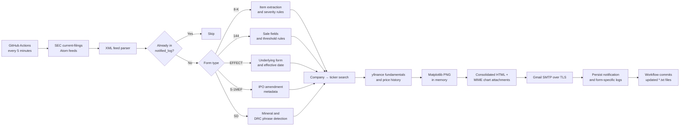

# SEC News Scraper

<div align="center">

**From raw EDGAR filings to decision-ready email briefings—automatically.**

[](https://github.com/TanishC4444/SECnewsScraper/actions/workflows/sec_monitor.yml)


[Overview](#overview) · [Architecture](#architecture) · [How It Works](#how-it-works) · [Setup](#setup) · [Engineering](#engineering-deep-dive)

</div>

---

## Overview

SEC News Scraper is an automated Python monitoring pipeline for selected [SEC EDGAR](https://www.sec.gov/edgar/search-and-access) filings. On each run, it retrieves the newest filing from five form-specific Atom feeds, rejects filings that were already reported, applies form-aware parsing and rule-based classification, enriches the result with Yahoo Finance data, renders stock charts, and delivers one consolidated HTML email.

The project connects regulatory data ingestion, document parsing, market-data enrichment, visualization, stateful automation, and multipart email delivery in a single end-to-end workflow.

> [!IMPORTANT]
> The classifications produced by this project are deterministic heuristics—not financial advice, investment recommendations, or a substitute for reading the original filing.

## What It Monitors

| Filing | What the pipeline extracts | Implemented filtering / classification |
|---|---|---|
| **8-K** | Recognized Item sections and their filing text | Maps 20 Item codes to `NEUTRAL`, `WATCH`, `MAJOR WATCH`, `BEARISH`, or `VERY BEARISH`; skips filings without a recognized, non-empty Item section |
| **Form 144** | Issuer, seller, relationship, shares, market value, shares outstanding | Processes proposed sales above **5,000 shares**; calculates the sale as a percentage of shares outstanding and classifies officer/director vs. other sales |
| **S-1MEF** | Company and filing metadata | Labels the filing as an IPO registration amendment and includes source links |
| **EFFECT** | Underlying registration form and effective date | Reads the filing's primary XML document, explains known underlying forms, and skips `N-2` registrations |
| **SD** | Conflict-mineral terms, DRC-status phrases, supplier references, smelter/refiner mentions | Produces rule-based ESG/compliance labels from filing text |

Every eligible filing can also receive ticker resolution, price and volume history, performance metrics, fundamentals, a four-quarter income-statement table, and an inline 30-day chart when Yahoo Finance data is available.

## Key Features

- **Form-aware parsing** — separate extraction paths for event reports, insider-sale notices, registration effectiveness notices, IPO amendments, and conflict-minerals disclosures.
- **Explainable signals** — explicit lookup tables and thresholds make every classification traceable to code.
- **Market context** — automatically resolves a probable ticker and retrieves pricing, volume, valuation, beta, range, and quarterly financial data.
- **Email-native visualization** — builds a dark price/volume chart with Matplotlib, encodes it in memory, and embeds it using a unique MIME Content-ID.
- **Batch delivery** — combines all newly discovered filings into one styled HTML briefing instead of sending one message per form.
- **Persistent deduplication** — derives an ID from form, CIK, and accession number, then records successful notifications in `notified_log.txt`.
- **Scheduled operation** — GitHub Actions runs the monitor every five minutes and supports manual dispatch.
- **Graceful enrichment fallback** — a filing can still be reported when ticker lookup or market-data enrichment is unavailable.

## Architecture



### Runtime workflow

1. Load processed filing IDs from `notified_log.txt` into a set.
2. Query the SEC current-filings Atom endpoint for the newest `EFFECT`, `S-1MEF`, `8-k`, `144`, and `SD` filing.
3. Build a stable identifier from the form type, CIK, and accession number.
4. Route unseen filings through their form-specific parser and eligibility rules.
5. Resolve the company name to a probable Yahoo Finance ticker.
6. Fetch market history and fundamentals; generate the price/volume chart in memory.
7. Assemble form-specific HTML cards and one batch email.
8. Send the multipart message through Gmail SMTP with STARTTLS.
9. After delivery returns successfully, append notification IDs and form-specific audit entries.
10. In GitHub Actions, commit changed `*.txt` state files back to the repository.

## Engineering Deep Dive

### 1. SEC ingestion and identity

`get_filings()` calls the SEC's current-filings endpoint with `output=atom` and parses entries with `xml.etree.ElementTree`. The checked-in entry point requests `count=1`, so each run examines the newest filing for each configured form—not the full recent history.

The deduplication key is normally:

```text
<form>-<CIK>-<accession-number>
```

Using a set for previously notified IDs gives constant-time membership checks. The state is deliberately written only after the batch email completes, which favors retrying over silently losing a notification when delivery fails.

### 2. 8-K event classification

The 8-K path converts the filing index URL to the raw `.txt` submission, removes markup, normalizes whitespace, and extracts Item sections with a boundary-aware regular expression. Recognized Item numbers are mapped to human-readable descriptions and fixed severity labels.

The overall filing signal escalates to the strongest category found: `VERY BEARISH` outranks `BEARISH`, which outranks watch-level and neutral events. This is transparent and fast, but it classifies the reported Item code—not the semantic tone of the company's narrative.

### 3. Form 144 arithmetic

`parse_form144()` extracts XML-like tags from the raw submission and uses `Decimal` to calculate:

```text
percentage of company = proposed shares sold / shares outstanding × 100
```

The main workflow ignores proposed sales of 5,000 shares or fewer. Officer/director sales are separated into minor, insider, and major-insider tiers at `0.1%` and `1.0%`; other relationships receive an institutional-sale label.

### 4. EFFECT and SD parsing

For EFFECT filings, the code derives the CIK and accession number from the SEC URL, requests `xslEFFECTX01/primary_doc.xml`, and extracts the underlying form and effective date. It uses Beautiful Soup and regex as a fallback when strict XML parsing fails.

The SD parser lowers the raw filing text and searches for mineral synonyms, DRC-status phrases, supplier references, and smelter/refiner language. This makes the result explainable and inexpensive, while also making it sensitive to phrasing and negation.

### 5. Market enrichment and visualization

Ticker resolution uses Yahoo Finance's search endpoint. `yfinance` then supplies:

- 5-day, 1-month, 3-month, and 1-year price history;
- current/previous price context, market capitalization, volume, P/E, price-to-book, dividend yield, and beta;
- day and 52-week ranges;
- the four most recent quarterly income-statement columns when available.

Matplotlib renders a two-panel 30-day price and volume figure. The PNG never needs a temporary file: it is written to `BytesIO`, Base64-encoded, and later attached to the email with a per-filing Content-ID.

### 6. Email composition

Each parser returns a common record containing `form_type`, `company`, `html_content`, and `entry_id`. This small shared contract lets the orchestration layer aggregate heterogeneous filings without coupling the batch email builder to every parser's internal fields.

The final message uses `multipart/related` for inline charts and `multipart/alternative` for plain-text and HTML bodies. Form-specific cards include filing context, signal colors, market information when available, and direct SEC links.

## Repository Structure

```text
SECnewsScraper/
├── .github/
│   └── workflows/
│       └── sec_monitor.yml       # Scheduled and manual automation
├── main.py                       # Ingestion, parsing, enrichment, charts, email
├── notified_log.txt              # Cross-run deduplication state
├── eightk_log.txt                # Processed 8-K history
├── form144_log.txt               # Processed Form 144 history
├── s1mef_log.txt                 # S-1MEF notification history
├── sd_log.txt                    # Processed SD history
├── effect_filings_log.txt        # Reserved/legacy EFFECT log file
├── EIGHTK_LOG_FILE               # Legacy 8-K log artifact
└── README.md
```

The application is currently implemented as a single Python module. That keeps deployment simple, but the parser, enrichment, presentation, transport, and orchestration concerns would be natural module boundaries as the project grows.

## Setup

### Prerequisites

- Python **3.10** (the version used by the workflow)
- A Gmail account with an app password for SMTP authentication
- Network access to SEC EDGAR and Yahoo Finance

### 1. Clone and create an environment

```bash
git clone https://github.com/TanishC4444/SECnewsScraper.git
cd SECnewsScraper

python -m venv .venv
source .venv/bin/activate
```

Windows PowerShell activation:

```powershell
.venv\Scripts\Activate.ps1
```

### 2. Install the dependencies used by the code

The repository does not currently include a dependency manifest. Install the same packages used by the GitHub Actions workflow:

```bash
python -m pip install --upgrade pip
python -m pip install requests beautifulsoup4 yfinance matplotlib pandas pytz
```

### 3. Configure email and SEC identity

Set the SMTP password in your shell:

```bash
export EMAIL_PASSWORD="your-gmail-app-password"
```

PowerShell:

```powershell
$env:EMAIL_PASSWORD = "your-gmail-app-password"
```

Before running, update these configuration values near the top of `main.py` for your environment:

- `EMAIL_ADDRESS` — authenticated Gmail sender;
- `RECIPIENT_EMAIL` — destination address;
- `headers["User-Agent"]` — a descriptive SEC User-Agent with your contact information.

> [!CAUTION]
> The current source includes a fallback value when `EMAIL_PASSWORD` is absent. Remove that fallback and rotate any exposed credential before deploying or sharing a fork. Use only an environment variable or repository secret.

### 4. Run locally

```bash
python main.py
```

The script prints progress for each form. If it finds eligible unseen filings, it sends one batch message and updates the local log files; otherwise it exits with `No new filings found.`

## GitHub Actions Automation

The checked-in workflow can be launched manually or on this UTC cron schedule:

```yaml
schedule:
  - cron: '*/5 * * * *'
```

That expression requests a run every five minutes, every day. Scheduled GitHub Actions runs can be delayed, and the code itself does not restrict execution to market hours.

To enable email delivery:

1. Open **Settings → Secrets and variables → Actions** in your fork.
2. Create a repository secret named `EMAIL_PASSWORD`.
3. Ensure the workflow has permission to push the updated `*.txt` logs.
4. Run **SEC Filing Monitor** manually once and review the output before relying on the schedule.

The workflow checks out the repository, installs the runtime packages, runs `main.py`, and commits changed text logs with `[skip ci]` to avoid a push-triggered loop.

## Design Decisions and Tradeoffs

| Decision | Benefit | Tradeoff |
|---|---|---|
| Latest filing only (`count=1`) | Small, predictable workload per scheduled run | Bursts between runs can cause filings to be missed |
| Flat files as durable state | Zero database or service setup | Repository growth, write contention, and limited querying |
| Synchronous requests | Straight-line control flow and simple debugging | SEC and market requests are serialized, increasing runtime |
| Rule-based signal labels | Fast, explainable, deterministic results | Filing context, nuanced language, and negation may be missed |
| Company-name ticker search | Adds market context without maintaining a symbol map | The top Yahoo result can be wrong or absent |
| Single-file application | Easy deployment in one workflow step | Parsing, presentation, and transport are tightly coupled |
| Inline MIME charts | Rich self-contained briefings | Larger messages and varying email-client CSS support |
| Commit logs back to Git | State survives stateless CI runners | Automation requires branch write access and may conflict with concurrent runs |

## Reliability and Current Constraints

- Individual 8-K, Form 144, and SD processing blocks catch broad exceptions and continue, while feed retrieval and final SMTP errors can still fail the run.
- HTTP requests are not consistently configured with timeouts, retries, backoff, or explicit SEC throttling.
- The SD and 8-K analyzers are lexical/rule-based; their labels should be treated as triage hints.
- Yahoo Finance is an enrichment dependency, not the system of record. Always verify the linked SEC filing.
- `notified_log.txt` is updated after email delivery, providing at-least-once behavior across failed sends but no transactional protection against concurrent workflow runs.
- There is currently no automated test suite, package manifest, database, command-line interface, or historical backfill mode.
- The project monitors the newest filing in each feed globally; it does not implement company watchlists.

## Skills Demonstrated

| Area | Evidence in the implementation |
|---|---|
| **Data engineering** | Multi-source ingestion, normalization, enrichment, batching, and persisted processing state |
| **Document parsing** | Atom/XML traversal, HTML fallback parsing, regex extraction, entity decoding, and filing-specific schemas |
| **Financial data handling** | Exact percentage arithmetic with `Decimal`, historical price windows, financial-statement metrics, and valuation data |
| **Automation / DevOps** | Cron-based GitHub Actions workflow, secret injection, stateless runner setup, and state commits |
| **Data visualization** | Programmatic price/volume charts, performance annotations, dark-theme styling, and in-memory image encoding |
| **Systems integration** | SEC EDGAR, Yahoo Finance search, `yfinance`, Gmail SMTP, TLS, MIME, and embedded assets |
| **Reliability design** | Deduplication keys, post-delivery state writes, form-level exception isolation, and enrichment fallback paths |
| **Product communication** | Filing explanations, severity hierarchy, source links, readable timestamps, and consolidated email UX |

## Resume-Ready Highlights

- Built an end-to-end Python pipeline that transforms live SEC EDGAR Atom feeds and filing documents into structured, form-aware email intelligence.
- Implemented dedicated parsers and explainable classification rules for 8-K, Form 144, S-1MEF, EFFECT, and SD filings.
- Integrated Yahoo Finance enrichment and generated in-memory Matplotlib price/volume charts embedded directly in multipart HTML email.
- Designed persistent CIK/accession-based deduplication for recurring stateless GitHub Actions runs and automated state commits.
- Combined heterogeneous filing outputs behind a shared record contract to deliver one consolidated notification per run.

## Responsible Use

- Identify your client with an accurate contact-bearing User-Agent and follow the SEC's published [fair-access guidance](https://www.sec.gov/about/developer-resources).
- Verify all classifications and market data against the original SEC document.
- Protect SMTP credentials with environment variables or GitHub Actions secrets.
- Do not treat the project's labels as investment advice or automated trading signals.

## Roadmap Grounded in the Current Design

The most valuable next engineering steps are to add a pinned dependency manifest, remove all credential fallbacks, split the single module into testable components, add fixture-based parser tests, introduce request timeouts/retries and SEC-aware rate control, process more than one recent filing safely, and move durable state from committed logs to a transactional store.

## License

No license file is currently included. Unless a license is added, normal copyright restrictions apply.

---

<div align="center">

Built with Python, public regulatory data, and an automation-first mindset.

</div>
