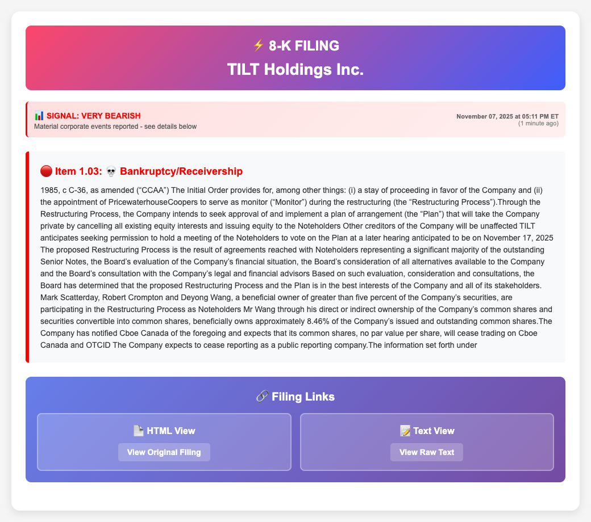
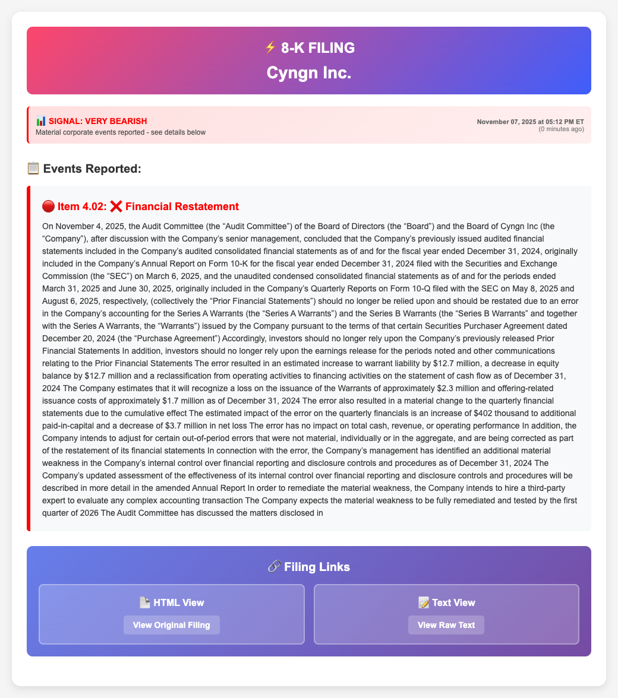
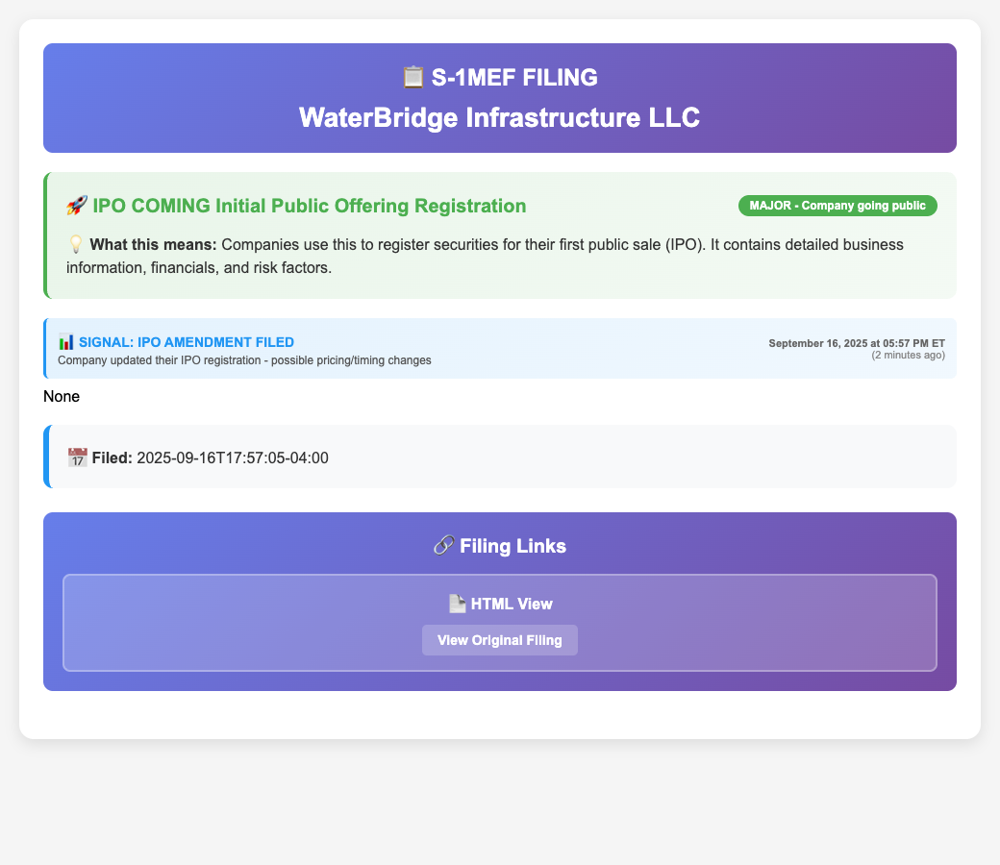
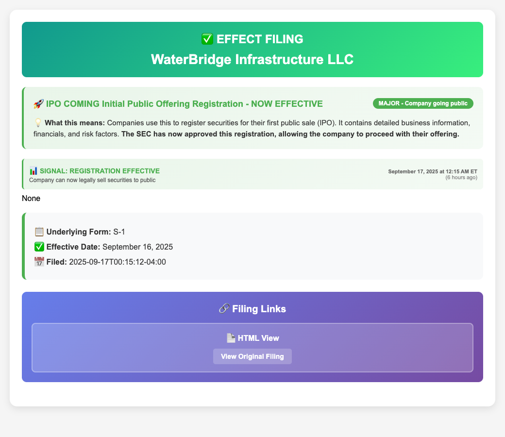
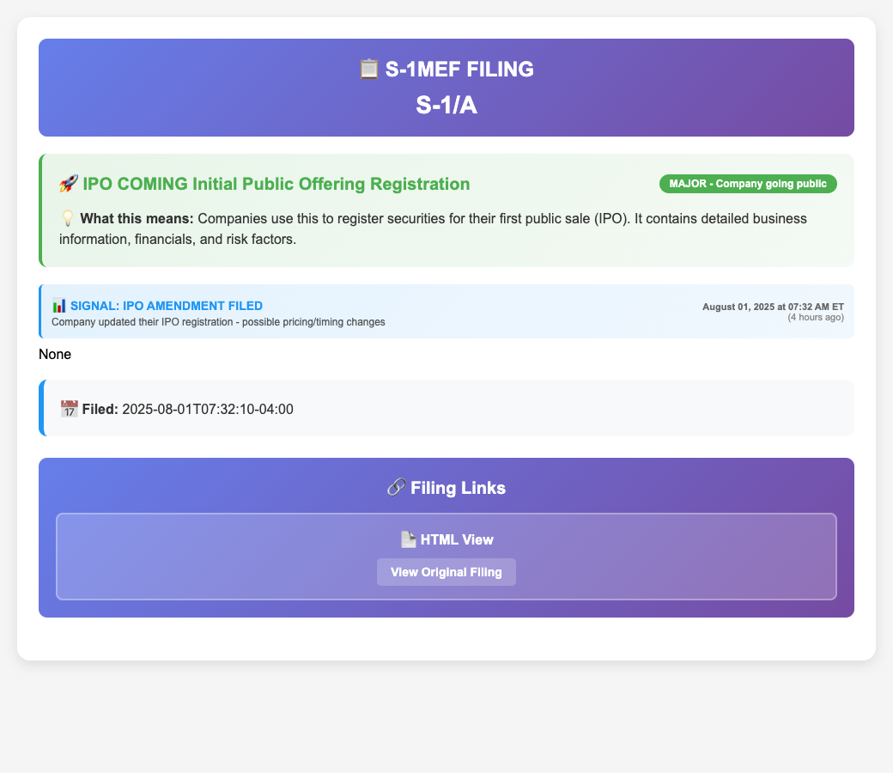
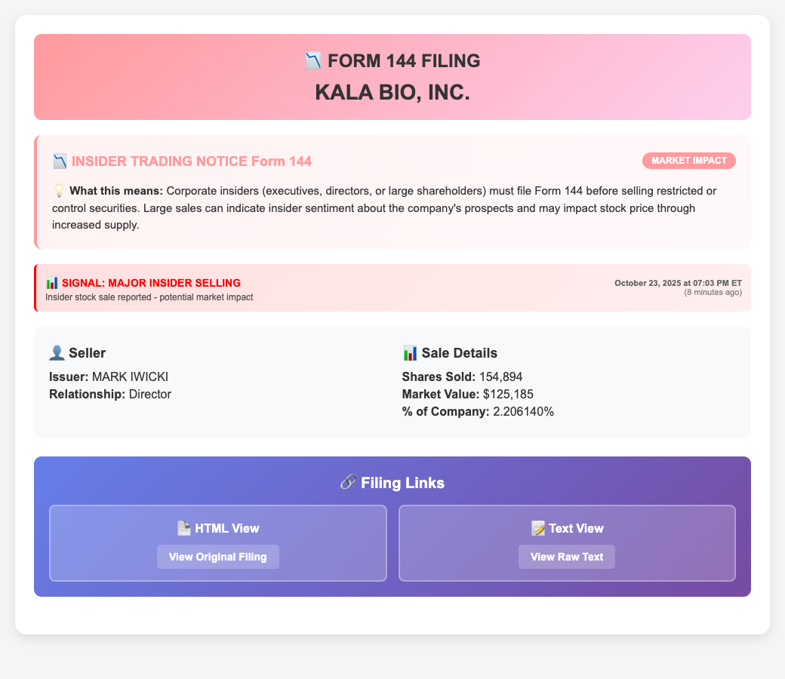
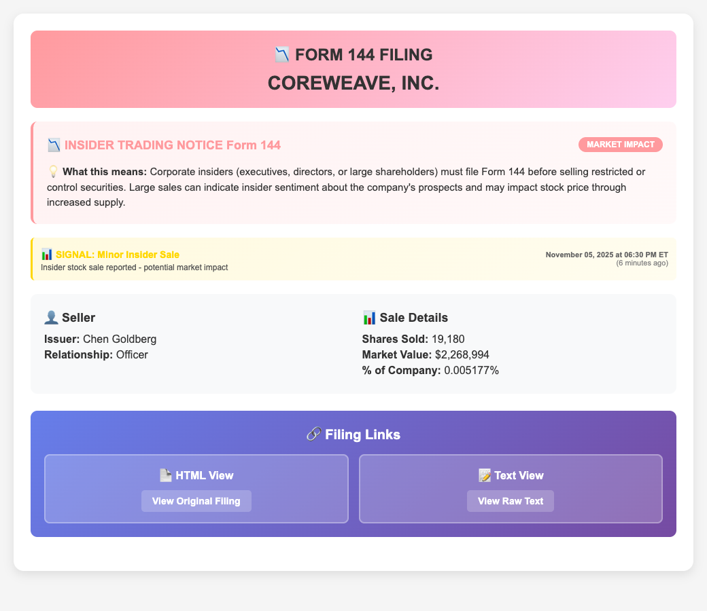
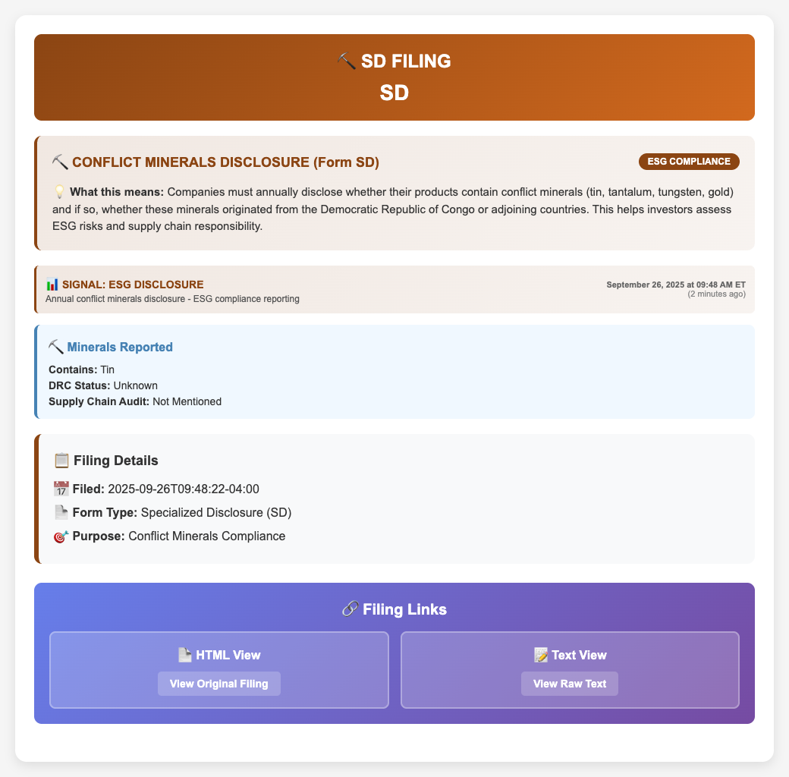

# SEC Filing Alerts: Real Emails and Significant Events

This gallery shows real alerts produced by [SECnewsScraper](https://github.com/TanishC4444/SECnewsScraper), with examples of every filing type monitored by the project: **8-K, Form 144, EFFECT, S-1MEF, S-1, S-1/A, and SD**. The strongest examples connect an alert to a specific corporate event and, where available, a subsequent public outcome.

The project polls EDGAR, extracts filing details, applies rule-based labels, adds financial context, and sends HTML email summaries. Its GitHub Actions workflow is scheduled every five minutes; that schedule is not a guarantee of delivery latency.

## What the screenshots show

These are **browser-rendered excerpts of the original received email HTML**, not screenshots of the Gmail interface. Original wording, colors, and labels are retained. Inbox headers, unrelated filings, and financial overview/chart panels are omitted. The TILT excerpt retains only Item 1.03 from its event list. Visible errors such as `None` and incorrect company/form labels are preserved and explained below.

Examples were selected from targeted mailbox searches for “SEC Filings,” individual filing categories, and significant signal labels. This is a curated gallery, not an exhaustive ranking or a backtest. “Significant” means a substantive disclosure or verified corporate milestone; it does not establish profitable trading performance.

## Strongest examples at a glance

| Example | Alert evidence | Independently verified significance | Assessment |
| --- | --- | --- | --- |
| TILT Holdings — 8-K | `VERY BEARISH`; restructuring and proposed cancellation of existing equity | Later filing confirmed trading suspension and a delisting notice | Strong risk-triage example; no demonstrated opportunity to trade before suspension |
| Cyngn — 8-K | `VERY BEARISH`; Item 4.02 non-reliance/restatement | Issuer disclosed warrant-accounting errors and an additional material weakness | Strong accounting-risk alert; no claim of a subsequent price prediction |
| WaterBridge — S-1MEF + EFFECT | Registration expansion and effectiveness | Upsized IPO closed two days after the S-1MEF alert | Strong offering-milestone example |
| Heartflow — S-1/A | Amendment detected, although company label was broken | IPO later priced and closed, raising approximately $364.2 million including the option | Useful discovery alert requiring a click through to identify the issuer |
| KALA BIO — Form 144 | Proposed sale representing about 2.21% of reported shares outstanding | SEC confirms the notice and reporting person | Notable supply-monitoring example; execution and subsequent market impact not established here |

## 1. Form 8-K — TILT Holdings: restructuring and equity risk

**Filing:** November 7, 2025. **Email received:** 5:13:18 p.m. Eastern.

The alert surfaced a proposed CCAA restructuring that would cancel existing equity and issue equity to noteholders. That makes the underlying disclosure materially more useful than a generic bearish badge: it identifies the mechanism threatening shareholders.

The [original filing](https://www.sec.gov/Archives/edgar/data/1761510/000110465925108571/0001104659-25-108571-index.htm) was followed by a [November 14 update](https://www.sec.gov/Archives/edgar/data/1761510/000110465925112716/tilt-20251107x8k.htm) confirming that trading had been suspended on November 7 and that the shares were scheduled for delisting on November 18. A [December 31 filing](https://www.sec.gov/Archives/edgar/data/1761510/000110465925125661/tilt-20251230xs8pos.htm) subsequently reported court approval of the arrangement on December 5 and plans to deregister the common stock.

**Why it belongs here:** the alert captured a concrete threat to shareholder value that later disclosures substantiated. Because suspension occurred on the same date, this is evidence of useful monitoring, not proof of an actionable advance warning.

## 2. Form 8-K — Cyngn: financial statements could no longer be relied upon

**Filing:** November 7, 2025. **Email received:** 5:13:18 p.m. Eastern, in the same digest as TILT.

The alert extracted Item 4.02 and applied `VERY BEARISH`. The [SEC filing](https://www.sec.gov/Archives/edgar/data/1874097/000121390025107677/ea0264618-8k_cyngn.htm) confirms that the board concluded on November 4 that the 2024 annual statements and the March and June 2025 quarterly statements required restatement. Estimated effects included a $12.7 million increase in warrant liabilities and corresponding decrease in equity. Management also identified an additional material weakness.

**Why it matters:** a reader could immediately identify financial-reporting reliability risk. The company explicitly said the error did not affect total cash, revenue, or operating performance. That qualification matters: the disclosure does not support claiming an equivalent deterioration in the operating business. No post-alert return is attributed to this event here.

## 3. S-1MEF — WaterBridge: an upsized IPO approaching completion

**Accepted:** September 16, 2025, 5:57:05 p.m. Eastern. **Email received:** 5:59:10 p.m. Eastern — approximately **2 minutes 5 seconds later**.

The [EDGAR filing index](https://www.sec.gov/Archives/edgar/data/2064947/000119312525205179/0001193125-25-205179-index.htm) identifies this as an actual **S-1MEF**, registering additional securities under Rule 462(b). The email's “IPO amendment” wording is imprecise: S-1MEF is distinct from an ordinary S-1/A amendment.

WaterBridge [announced the closing](https://www.sec.gov/Archives/edgar/data/2064947/000119312525207591/wbi-ex99_2.htm) of its upsized IPO on September 18: **31.7 million shares at $20**, or **$634 million gross** before expenses and the additional option shares. The [related 8-K](https://www.sec.gov/Archives/edgar/data/2064947/000119312525207591/wbi-20250916.htm) documents the transaction.

**Why it matters:** this alert surfaced a registration expansion shortly before a substantial offering closed. It demonstrates timely event discovery; it does not establish that the alert beat the pricing announcement or predicted aftermarket returns.

## 4. EFFECT — WaterBridge: registration effectiveness

**Notice accepted:** September 17, 2025, 12:15:12 a.m. Eastern. **Effective date:** September 16. **Email received:** September 17, 6:25:45 a.m. Eastern.

The [notice of effectiveness](https://www.sec.gov/Archives/edgar/data/2064947/999999999525002975/9999999995-25-002975-index.htm) corresponds to the underlying S-1 registration. Together with the prior S-1MEF alert, it shows two stages of the same offering rather than two independent investment opportunities.

**Why it matters:** effectiveness is a concrete registration milestone. The subsequent IPO closing is documented above. The email's phrase “SEC has now approved this registration” should not be read as an endorsement of the issuer, security, or investment merits. The roughly six-hour notice-to-email interval also shows why a five-minute schedule alone cannot substantiate a universal five-minute alerting claim.

## 5. S-1/A — Heartflow: amendment before an IPO

**Accepted:** August 1, 2025, 7:32:10 a.m. Eastern. **Email received:** 11:41:53 a.m. Eastern.

Although the screenshot displays `S-1MEF FILING` and `S-1/A` where a company name should appear, its [original filing link](https://www.sec.gov/Archives/edgar/data/1464521/000162828025037144/0001628280-25-037144-index.htm) identifies **Heartflow, Inc.** and the actual form **S-1/A**.

Heartflow [announced pricing on August 7](https://ir.heartflow.com/news-releases/news-release-details/heartflow-inc-announces-pricing-upsized-initial-public-offering), then [confirmed closing on August 11](https://ir.heartflow.com/news-releases/news-release-details/heartflow-inc-announces-closing-upsized-initial-public-offering): 19,166,667 shares at $19, including the fully exercised underwriter option, for approximately **$364.2 million gross**. Trading began August 8.

**Why it matters:** the alert put the registration on a reader's radar before pricing and trading. Its broken issuer label reduced that usefulness; identification here comes from EDGAR, not a silently corrected screenshot.

## 6. S-1 — Evolution Global Acquisition: initial registration discovery

**Accepted:** July 31, 2025, 5:15:22 p.m. Eastern. **Email received:** August 1, 11:41:53 a.m. Eastern.

The [SEC index](https://www.sec.gov/Archives/edgar/data/2077954/000121390025070078/0001213900-25-070078-index.htm) identifies **Evolution Global Acquisition Corp** and form **S-1**. The project routes S-1 and S-1/A through the same email template as S-1MEF, explaining the misleading heading.

The company later [announced pricing of an upsized $210 million IPO](https://www.sec.gov/Archives/edgar/data/2077954/000121390025109490/ea026537601ex99-1_evolution.htm) on November 10, 2025, at $10 per unit.

**Why it matters:** initial registrations can support a longer-term offering watchlist. The months-long interval illustrates why an S-1 should not automatically be interpreted as an imminent listing or a bullish trade.

## 7. Form 144 — KALA BIO: proposed sale large relative to the reported share base

**Accepted:** October 23, 2025, 7:03:40 p.m. Eastern. **Email received:** 7:11:51 p.m. Eastern.

The alert reports director **Mark Iwicki**, **154,894 shares**, approximately **$125,185**, and **2.206140%** of reported shares outstanding. The [SEC index](https://www.sec.gov/Archives/edgar/data/1479419/000195004725008142/0001950047-25-008142-index.htm) confirms the reporting person and Form 144; a [public reproduction of the notice](https://www.streetinsider.com/SEC%2BFilings/Form%2B144%2BKALA%2BBIO%2C%2BInc.%2BFiled%2Bby%3A%2BIwicki%2BMark%2BT/25496164.html) lists 7,021,040 shares outstanding. Dividing 154,894 by 7,021,040 reproduces the alert's percentage.

**Why it matters:** this is a clear example of the project's size-based filter. Its `MAJOR INSIDER SELLING` threshold is more than 1% for an officer or director. However, Form 144 is a **notice of proposed sale**; the screenshot's “Shares Sold” label does not itself prove execution, bearish intent, or later selling pressure. The percentage is relative to the reported outstanding share count, not the seller's personal holdings. This example is not presented as a verified price-prediction success.

### Comparison: CoreWeave's larger dollar amount, smaller ownership percentage

**Email received:** November 5, 2025, 6:36:42 p.m. Eastern.

This alert reports **Chen Goldberg**, 19,180 shares, approximately **$2.27 million**, and **0.005177%** of the reported share base, resulting in `Minor Insider Sale`. Its [original filing link](https://www.sec.gov/Archives/edgar/data/2058056/000205805625000004/0002058056-25-000004-index.htm) is retained for traceability; that notice could not be independently retrieved during this review. The figures here are therefore attributed to the email.

The comparison demonstrates how the implemented classifier works: dollar size alone does not determine its severity label. Neither example establishes predictive accuracy.

## 8. Form SD — Northern Oil and Gas: disclosure found, interpretation incorrect

**Accepted:** September 26, 2025, 9:48:22 a.m. Eastern. **Email received:** 9:51:07 a.m. Eastern.

The email labels the issuer `SD` and describes conflict minerals. The [SEC index](https://www.sec.gov/Archives/edgar/data/1104485/000110448525000148/0001104485-25-000148-index.htm) identifies **Northern Oil and Gas, Inc.** The [actual report](https://www.sec.gov/Archives/edgar/data/1104485/000110448525000148/nog-formsd2025.htm) concerns **resource-extraction payment disclosure under Rule 13q-1**, not conflict-minerals reporting.

**Why it belongs here:** it provides the requested SD coverage and an honest boundary on the system's interpretation. The filing was detected, but the company matching and disclosure classification failed. It should not be marketed as a successful ESG-risk or stock-price signal.

## Coverage and interpretation notes

| Monitored feed | Example in this gallery | Important distinction |
| --- | --- | --- |
| 8-K | TILT; Cyngn | The item text establishes the event; the severity badge is a heuristic |
| 144 | KALA BIO; CoreWeave | Proposed sale, not execution confirmation |
| EFFECT | WaterBridge | Registration effectiveness, not investment endorsement |
| S-1MEF | WaterBridge | Additional securities under Rule 462(b) |
| S-1 | Evolution Global Acquisition | Original registration; currently mislabeled by the email template |
| S-1/A | Heartflow | Amendment; currently mislabeled by the email template |
| SD | Northern Oil and Gas | Determine the applicable disclosure rule before classifying |

“Every type” here means the seven feeds listed in the local project's `form_types`, not every SEC form or every possible 8-K item. The explanatory dictionary contains other forms, such as S-3 and F-1, that can appear as underlying registrations in EFFECT alerts; they are not additional independently polled feeds in this version.

Email receipt times above come from message metadata converted to America/New_York. Some original digest “Run Date” labels appear to display UTC clock times with an ET suffix, so those banners are not used for latency calculations. Individual acceptance times and effectiveness dates are kept distinct. Any latency stated is for that example only.

The strongest supported project claim is **automated discovery and prioritization of substantive disclosures, with links back to the evidence**. A return-based effectiveness study would additionally require a defined alert universe, executable entry times, adjusted prices, benchmark returns, and consistent evaluation windows. Historical price changes embedded in an email precede or coincide with delivery; they are not returns earned after the alert.

*Prepared September 8, 2026 from received project alerts and the linked public records. All screenshot assets use relative paths so this file can be viewed directly on GitHub.*
